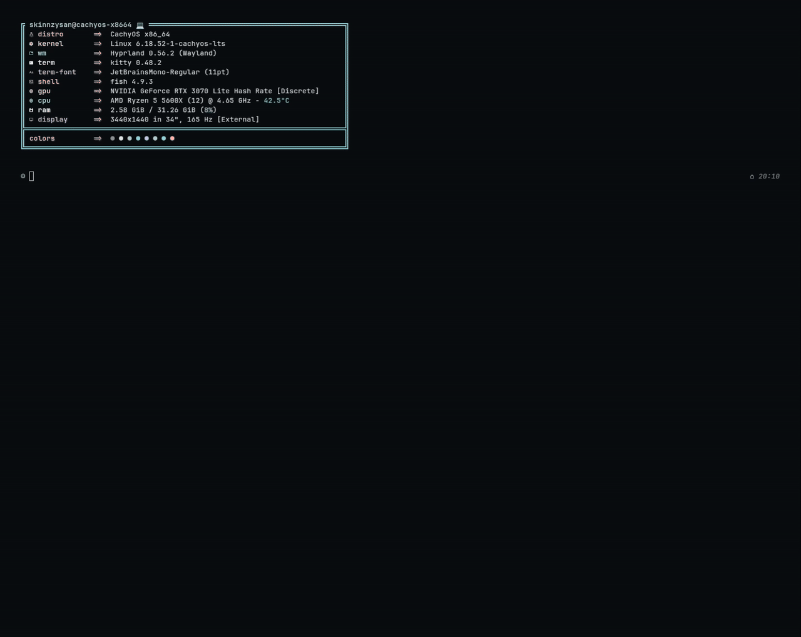

<div align="center">
  <a href="https://rust-lang.org/"></a>
  
  <a href="https://github.com/skinnzysan/apollo-music-player/blob/main/LICENSE"></a>
</div>

<div align="center">
  <a href="#Installation"></a>
  <a href="#usage"></a>
  <a href="#Configuration"></a>
  <a href="https://github.com/skinnzysan/apollo-music-player/blob/main/CHANGELOG.md"></a>
</div>

---



> **Note:** This program was entirely **vibe coded** using antigravity with Gemini 3.1 Pro (Low).

## Features

- **TUI Interface:** Beautiful and responsive terminal interface built with `ratatui`.
- **Theme Integration:** Adapts seamlessly to your terminal's native color scheme for a personalized look.
- **Format Support:** High-quality playback for various audio formats, including lossless **FLAC** and more.
- **Audio Visualizers:** Integrated audio visualizer with toggleable Spectrum (FFT) and Waveform (PCM) modes.
- **Library Management:** Automatically scans and organizes your music by Artists, Albums, Tracks, and Genres. Includes a file Explorer tab.
- **Playback Controls:** Full support for shuffling, looping (track, queue, none), muting, and volume control.
- **Instant Search:** Quickly find any track, album, or artist in your library.
- **Localization:** Supports English (default) and Polish.
- **Customizable Library Path:** Set your library root via CLI or config file. Defaults to your system's `~/Music` folder.

## Installation

### Quick Install (Linux)

You can easily install Apollo using our installation script which handles dependencies and building automatically:

```bash
curl -sSL https://raw.githubusercontent.com/skinnzysan/apollo-music-player/main/install.sh | bash
```
*(Make sure to replace `skinnzysan` with your actual username/repo path if you host it elsewhere)*

### Manual Build

#### Dependencies
Before building manually, ensure you have Rust (`cargo`) installed along with the required ALSA development libraries and build tools for your system:

- **Debian / Ubuntu:** `sudo apt install libasound2-dev build-essential pkg-config`
- **Arch Linux:** `sudo pacman -S alsa-lib base-devel`
- **Fedora:** `sudo dnf install alsa-lib-devel gcc pkgconf-pkg-config`
- **openSUSE:** `sudo zypper install alsa-devel gcc pkg-config`

#### Build Instructions
Once dependencies are installed, clone the repository and build the project:

```bash
git clone https://github.com/yourusername/apollo-music-player.git
cd apollo-music-player
cargo build --release
```

The compiled binary will be available in `target/release/apollo`.

## Usage

Start the player by running:
```bash
apollo
```

To start the player and set a new default library path at the same time:
```bash
apollo ~/Path/To/Your/Music
```
*Note: Providing a path as an argument saves it to your config file for all future runs.*

## Configuration

Configuration is stored at `~/.config/apollo/config.toml` on Linux.

```toml
# Example config.toml
language = "en"               # Available options: "en", "pl"
library_paths = ["~/Music"]   # List of directories to scan for music
visualizer_color = "solid"    # Available options: "solid" (theme color), "rainbow" (multi-color)
show_logo = true              # Set to false to hide the Apollo logo and give more space to the library
```

## Keybindings

| Key | Action |
| --- | --- |
| `Space` | Play / Pause |
| `z`, `Left` | Previous track |
| `x`, `Right` | Next track |
| `j`, `Down` | Navigate down |
| `k`, `Up` | Navigate up |
| `Enter` | Play selected track / Expand tree branch |
| `<`, `>` | Seek -5s / +5s |
| `+`, `-` | Volume up / down |
| `m` | Mute |
| `s` | Toggle Shuffle |
| `l` | Toggle Loop mode (None, Track, Queue) |
| `v` | Toggle visualizer mode (Spectrum, Waveform) |
| `c` | Show / Hide visualizer |
| `h` | Show / Hide hotkeys in the UI |
| `F1` - `F5` | Switch tabs (Artists, Albums, Tracks, Genres, Explorer) |
| `/` | Search |
| `Esc` | Cancel search |
| `q`, `Ctrl+C`| Quit |

## Changelog

See the [CHANGELOG.md](CHANGELOG.md) file for details on new features, bug fixes, and improvements.

## License

This project is licensed under the MIT License.
